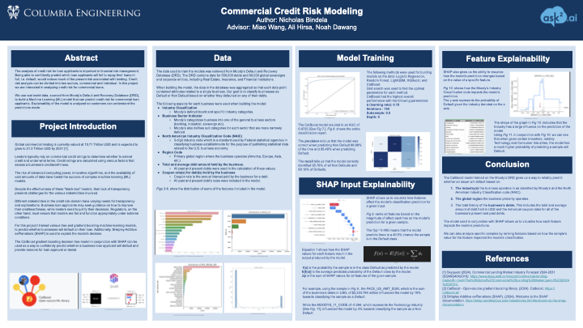

# Commercial-Credit-Risk

## Overview
This project analyzes commercial credit risk using machine learning models. Below is a visual representation of the project's poster:

*Figure: Poster summarizing the project's goals, methodology, and findings.*

The analysis focuses on predicting loan defaults for commercial loans using data from Moody’s Default and Recovery Database (DRD). Key techniques include gradient boosting models (CatBoost) and SHAP for explainability.

Please Download the pdf version of the poster for a higher quality view.